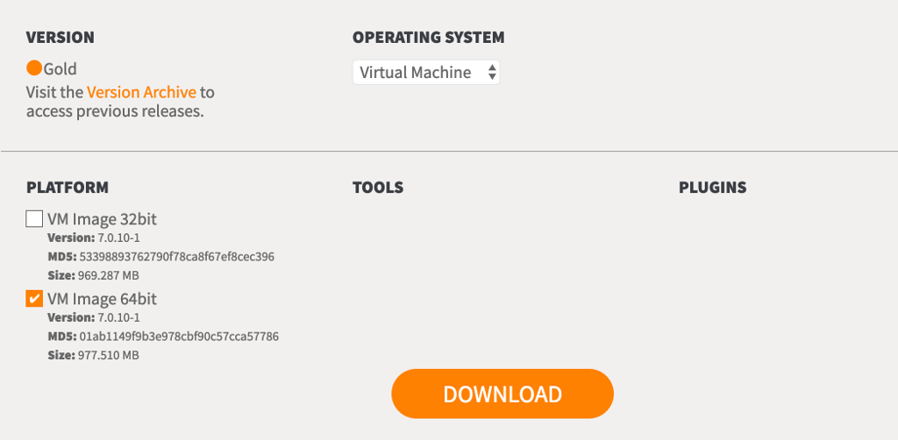

# Overview

This more advanced tutorial will explain how to go from a data source on the web to visualization of a summary of some of that data.
In this tutorial, you will learn:

1. How to download file from a url
2. Unzip the file you just downloaded. Other transformation could be done the same exact way, here the transformation is simply an "unzip"-ing.
3. Load file into am HPCC Systems Thor Cluster
4. Run ECL queries to make sure data was loaded properly, to transform raw format into final format and to create a summary of some of its content.
5. Generate an image-charts.com URL to visualise that summary in a browser.

# Audience

This tutorial is mostly intended for developers and system administrators/IT.
You need some knowledge of terminal, linux commands and how to set things up, including VirtualBox.

You do NOT need knowledge in HPCC Systems, but it might help (if anything goes wrong at that level).

# Table of contents

1. [Prerequisites](#Prerequisites)
   1. [HPCC Systems VM](#hpcc-systems-vm)
   2. [ETL-JS CLI](#etl-js-cli)
   3. [ETL file](#etl-file)
2. [Process](#process)
   1. [extract](#extract)
   2. [load](#load)
   3. [cert & transform](#cert-&-transform)
   4. [report](#report)
   5. [chart](#chart)
3. [Food for thoughts](#food-for-thoughts)
4. [Troubleshooting](#troubleshooting)

# Prerequisites

## HPCC Systems VM

For this tutorial, we simply need the HPCC System VM to run a single-node cluster inside VirtualBox for example.
Go to [https://hpccsystems.com/download](https://hpccsystems.com/download), select "Virtual Machine" and the platform you need (32bit or 64bit) and click "Download".



Once downloaded, double-click on it and import it using VirtualBox for example.
Run the VM and when fully booted up, it will give you its internal IP address.

Check you can access it with ssh:

```bash
ssh hpccdemo@_IP_ADDRESS_
```

Password is `hpccdemo`.

### Configuration files

We need to configure some of the mods we will be using during the ETL process. For example, when `spray`-ing files, we need to configure the url of the server to communicate with, the username and password if required, etc.

Create a file locally, name it `dfuplus.ini` and paste the following in it:

```
server=http://127.0.0.1:8010
username=hpccdemo
password=hpccdemo
overwrite=1
replicate=0
```

Create another file locally, name it `eclplus.ini` and paste the following in it:

```
server=127.0.0.1
username=hpccdemo
password=hpccdemo
#overwrite=1
#replicate=0
```

Now copy those files over to your VM:

```bash
scp dfuplus.ini eclplus.ini hpccdemo@_IP_ADDRESS_:/home/hpccdemo/
```

## ETL-JS CLI

```bash
npm install --global @lpezet/etl-js-cli
```

Check it installed properly:

```bash
etl-js help
```

The help should be displayed.

To access the VM you will install right after, we need a bit of configuration too.
Create a folder to work in and run etl-js cli initialization command.

```bash
mkdir etl-js-tut
cd etl-js-tut
etl-js init
```

Two files will be created, but we're interested in only one: `settings.yml`.
Paste the following in it:

```yml
etl:
  executor: remote1

executors:
  remote1:
    type: remote
    host: _IP_ADDRESS_OF_VM_
    username: hpccdemo
    password: hpccdemo

mods:
  sprays:
    "*":
      server: "127.0.0.1"
```

If you are curious, here's a bit of explanation.
The first part defines what kind of Executor to use to run ETL. Here we want to run it all on the VM, not on the host.

```yml
etl:
  executor: remote1

executors:
  remote1:
    type: remote
    host: _IP_ADDRESS_OF_VM_
    username: hpccdemo
    password: hpccdemo
```

You'll need to replace the `_IP_ADDRESS_OF_VM_` with the actual IP address of your VM you got earlier.

The next part is to configure one of the mod our ETL process will be using: `sprays`.
Sprays is a special mod for HPCC Systems. It leverages a tool to load content of files into a cluster (well here it's just 1 node).

```yml
mods:
  sprays:
    "*":
      server: "127.0.0.1"
```

This simply states the tool need to contact the server at `127.0.0.1` (being the local host on that VM).

## ETL file

Last but not least, we'll also need the definition of our little ETL process.
The raw version is accessible here and contains more comments and information in it: [prcp_snow_chart.yml](./prcp_snow_chart.yml).

Download it and put it in the directory you created earlier.
We'll discuss in details each step.

# Process

If you're impatient (and checked everything is in order), go to next section to run it.
BE AWARE that commands will be run on your Virtual Machine, files will be downloaded and created.

Open that .yml file you just downloaded.

The first part of the file is the _etl_ section. This defines the activities, and order, to run.

```yml
etlSets:
  default:
    - extract
    - load
    - cert
    - transform
    - report
    - chart
```

It simply means it will first run the _extract_ activity, the _load_ activity, then _cert_, etc.
It will finish with the _chart_ activity which will create a url for us to visualize the result of that _report_ activity.

## extract

The _extract_ activity does two things:

1. Download a file from an ftp site
2. Extract the content of that file it just downloaded.

```yml
extract:
  files:
    "/var/lib/HPCCSystems/mydropzone/noaa/ghcn/daily/by_year/2018.csv.gz":
      source: ftp://ftp.ncdc.noaa.gov/pub/data/ghcn/daily/by_year/2018.csv.gz
  commands:
    001_unzip:
      command: gunzip 2018.csv.gz
      cwd: /var/lib/HPCCSystems/mydropzone/noaa/ghcn/daily/by_year/
      test: "[ -f /var/lib/HPCCSystems/mydropzone/noaa/ghcn/daily/by_year/2018.csv.gz ]"
```

Couple of things to mention here:

- There's a _test_ in the `001_unzip` command. The command itself won't be executed if that test fails. Here it simply means it won't extract the content if the file doesn't exist.
- We use a _cwd_ to change directory prior to executing the `command:`.

## load

The _load_ activity simply loads the data we just extracted, into HPCC Systems Thor.

```yml
load:
  sprays:
    "noaa::ghcn::daily::2018::raw":
      format: csv
      destinationGroup: "mythor"
      sourcePath: /var/lib/HPCCSystems/mydropzone/noaa/ghcn/daily/by_year/2018.csv
```

This loads the file specified in `sourcePath` and create a logical file `noaa::ghcn::daily::2018::raw` in Thor.
The default options are used here (comma-delimited, default terminators, etc.) so there isn't much to specify.
The next required elements we need to make sure are in there are `format` and `destinationGroup`.

## cert & transform

Those two activities execute ECL code against our Thor cluster.

```yml
cert:
  ecls:
    000_cert_daily_2018:
      cluster: thor
      content: |
        layout := RECORD
            STRING station_id; // station identifier (GHCN Daily Identification Number)
            STRING date; // (yyyymmdd; where yyyy=year; mm=month; and, dd=day)
            STRING observation_type; // (see ftp://ftp.ncdc.noaa.gov/pub/data/ghcn/daily/readme.txt for definitions)
            STRING observation_value; // (see ftp://ftp.ncdc.noaa.gov/pub/data/ghcn/daily/readme.txt for units)
            STRING observation_time; // (if available, as hhmm where hh=hour and mm=minutes in local time)
        END;
        ds := DATASET('~noaa::ghcn::daily::2018::raw', layout, CSV);
        ASSERT(COUNT(ds) = 32357321);
transform:
  ecls:
    000_tx_daily_2018:
      content: |
        raw_layout := RECORD
            STRING station_id; // station identifier (GHCN Daily Identification Number)
            STRING date; // (yyyymmdd; where yyyy=year; mm=month; and, dd=day)
            STRING observation_type; // (see ftp://ftp.ncdc.noaa.gov/pub/data/ghcn/daily/readme.txt for definitions)
            STRING observation_value; // (see ftp://ftp.ncdc.noaa.gov/pub/data/ghcn/daily/readme.txt for units)
            STRING observation_time; // (if available, as hhmm where hh=hour and mm=minutes in local time)
        END;
        final_layout := RECORD
            STRING station_id;
            UNSIGNED date;
            STRING observation_type;
            STRING observation_value;
            UNSIGNED observation_time;
        END;
        rawDS := DATASET('~noaa::ghcn::daily::2018::raw', raw_layout, CSV);
        finalDS := PROJECT( rawDS, TRANSFORM(final_layout,
            SELF.date := (UNSIGNED) LEFT.date;
            SELF.observation_time := (UNSIGNED) LEFT.observation_time;
            SELF := LEFT;
        ));
        OUTPUT( finalDS,, '~noaa::ghcn::daily::2018::final', OVERWRITE);
```

The first activity fails if the data loaded doesn't contain the number of records we're expecting. This is a simple check and, in a production-like situation, would definitely not be enough.

The second activity formats the raw layout of the loaded data into its final structure. We go from STRING to UNSIGNED for some fields. This is not necessary for us here, but it shows how this could be achieved.

## report

This activity is very similar the the previous two (cert and transform). Its difference is that it will output results to a file

```yml
report:
  ecls:
    000_prcp_snow_2018:
      cluster: thor
      output: /var/lib/HPCCSystems/mydropzone/noaa_ghcn_daily_2018_prcp_snow_chart_data_raw.csv
      format: csvh
      content: |
        // 1) Create summary
        final_layout := RECORD
                STRING station_id;
                UNSIGNED date;
                STRING observation_type;
                STRING observation_value;
                UNSIGNED observation_time;
        END;
        ds := DATASET('~noaa::ghcn::daily::2018::final', final_layout, THOR);
        StationIds := ['US1COCF0015','US1COCF0020','US1COCF0041','USS0006L03S','USS0006L05S'];
        StationData := ds( station_id IN StationIds );
        summaryDS := TABLE( StationData( observation_type IN ['PRCP','SNOW'] ), 
            { station_id; observation_type; UNSIGNED total := SUM(GROUP, (UNSIGNED) observation_value); UNSIGNED days := COUNT(GROUP); }, station_id, observation_type );
        //summaryDS;

        // 2) Format data for chart
        chart_layout := RECORD
            STRING series;
            DECIMAL10_2 prcp;
            DECIMAL10_2 snow;
        END;

        prcpDS := TABLE( summaryDS( observation_type = 'PRCP' ), { STRING series := station_id; DECIMAL10_2 prcp := AVE(GROUP, total); DECIMAL10_2 snow := 0; }, station_id );
        snowDS := TABLE( summaryDS( observation_type = 'SNOW' ), { STRING series := station_id; DECIMAL10_2 prcp := 0; DECIMAL10_2 snow :=  AVE(GROUP, total); }, station_id );
        allDS := prcpDS + snowDS;
        chartData := ROLLUP(SORT( allDS, series ), LEFT.series = RIGHT.series, TRANSFORM( chart_layout,
            SELF.prcp := LEFT.prcp + RIGHT.prcp;
            SELF.snow := LEFT.snow + RIGHT.snow;
            SELF := LEFT;
        ));
        OUTPUT(chartData);
```

The ECL code might look complicated only because it accomplishes two purposes: 1) create a summary for only certain observations (`PRCP` and `SNOW`) for only some stations (e.g. `US1COCF0015`), and 2) transforms the data from that summary into a format we can easily leverage to create a chart.

## chart

The final activity generated a url to visualize the summary we created in the previous step.

```yml
chart:
  files:
    "/var/lib/HPCCSystems/mydropzone/csv_to_chart_data.sh":
      content: |
        #!/bin/bash
        file=$1
        skip_lines=${2:-1}
        header_line=${3:-1}
        columns=$(sed "${header_line}q;d" $file | sed "s/\,/\|/g" | sed s/\"//g | awk 'BEGIN { FS="|"; OFS="|" }; {first = $1; $1 = ""; print $0; }' | cut -c2-)
        tail_lines=`expr ${skip_lines} + 1`
        series=$(tail -n +${tail_lines} $file | awk 'BEGIN { FS=","; }; { print $1 }' | tr '\n' '|' | sed s/\"//g)
        data=$(tail -n +${tail_lines} $file | awk 'BEGIN { FS=","; OFS=","; }; { $1=""; print $0; }' | cut -c2- | sed s/\"//g | tr '\n' '|' | sed 's/.$//')
        echo $columns
        echo $series
        echo $data

  commands:
    000_chart_data:
      command: bash /var/lib/HPCCSystems/mydropzone/csv_to_chart_data.sh /var/lib/HPCCSystems/mydropzone/noaa_ghcn_daily_2018_prcp_snow_chart_data_raw.csv 2 2 > /var/lib/HPCCSystems/mydropzone/noaa_ghcn_daily_2018_prcp_snow_chart_data.txt

  image_charts:
    prcp_snow_chart:
      data: /var/lib/HPCCSystems/mydropzone/noaa_ghcn_daily_2018_prcp_snow_chart_data.txt
      chs: 700x200
      cht: bvg
      chxt: x,y
      chxs: 1N*s* inches,000000
```

The data generated from the step before cannot be used as it to create the url.
To create a url from image-charts.com, we need 1) the labels for the x-axis to be pipe ("|") delimited, 2) the names of the series also pipe ("|") delimited, 3) and then all the series values delimited by commas (",") and separated by a pipe ("|").
To generate all this, the _chart_ activity first creates a script `csv_to_chart_data.sh` that read the output of the previous step and generated those 3 elements.

It then execute that script against our `noaa_ghcn_daily_2018_prcp_snow_chart_data_raw.csv` file and generated a new file named `noaa_ghcn_daily_2018_prcp_snow_chart_data.txt`.

Finally, it reads that `noaa_ghcn_daily_2018_prcp_snow_chart_data.txt` file to generate the chart url.

# Run it

As mentioned earlier, BE AWARE that files will be downloaded and created and commands will be run on your Virtual Machine.

I recommend filtering activities when calling `etl-js` cli.
To run everything, simply use the following:

```bash
etl-js run prcp_snow_chart.yml
```

To run only certain activities at a time, add the name of activity at the end of the previous command, and if you want to run more than one activity, separate those by a comma (",").

If you wanted to run only say _extract_ and _load_ activities, you'd do:

```bash
etl-js run prcp_snow_chart.yml extract,load
```

For the very first run, it might be best to go about it step by step: first run the _extrat_ activity, then the _load_, then _cert_, etc, like so:

```bash
etl-js run prcp_snow_chart.yml extract
etl-js run prcp_snow_chart.yml load
etl-js run prcp_snow_chart.yml cert
# etc.
```

After running the very last activity (_chart_), you should get a url like this one:

> https://image-charts.com/chart?chs=700x200&cht=bvg&chxt=x,y&chxs=1N*s*%20inches,000000&....

Just copy it and paste it in a browser.

# Food for thoughts

## Settings and VM configuration files

One might wonder why having a separate file for settings (`settings.yml`) and creating configuration files on the VM (`dfuplus.ini` and `eclplus.ini`).

The reason is simple: security and shareability (apparently a word...).

It's best to keep username and password in separate files so one would commit its ETL files and NOT the `settings.yml` file. Each is then free to have different IPs for the VM, use username/password or private key instead, etc.

Same is true for `dfuplus.ini` and `eclplus.ini`. We couldn't want to specify their content as part of the mod definition in our ETL file. One cluster might need replication, another may not (e.g. for testing purposes), credentials might be different, etc.

If for whatever reason one would deem right to put the files `dfuplus.ini` and `eclplus.ini` as part of the ETL process, one would just need to add a new activity (say `prerequisites`) and specify it as first activity to run, like so:

```yml
etl:
  - prerequisites
  - extract
  - ...

prerequisites:
  files:
    "/home/hpccdemo/dfuplus.ini":
      content: |
        server=http://127.0.0.1:8010
        username=hpccdemo
        password=hpccdemo
        overwrite=1
        replicate=0
    "/home/hpccdemo/eclplus.ini":
      content: |
        server=127.0.0.1
        username=hpccdemo
        password=hpccdemo
extract: ...
```
